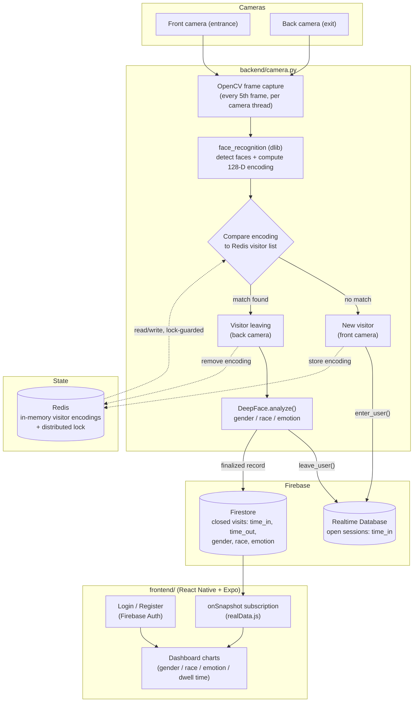

<p align="center">
  
</p>

<h1 align="center">Storelytics</h1>

<p align="center">
  Doorway in, dashboard out. Encodings, not photos.
</p>

<p align="center">
  <a href="https://github.com/rsheth8/Storelytics">Source</a>&nbsp;·&nbsp;<a href="CONTRIBUTING.md">Run locally</a>
</p>

<p align="center">
  
  
</p>

<p align="center"><sub>Class / portfolio only — not a store product. Read Privacy &amp; ethics before anything else.</sub></p>

---

## What this is

Storelytics is a class/portfolio project that answers a simple question for a small business owner: *"Who is coming into my store, and how are they feeling?"* — without hiring a human to stand at the door with a clicker.

Two cameras (one facing the entrance, one facing the exit) watch the doorway. When someone walks in, the system notices a new face, logs an arrival time, and starts tracking them. When that same person walks out, it logs a departure time and — using the exit-facing camera — makes a quick guess at their gender, race, and emotional expression. None of this is done by a human reviewing footage; it happens automatically, frame by frame, using computer-vision models.

The owner never sees a video feed. Instead, they open a phone app (the "dashboard") that shows aggregated charts — how many people visited today, how long they typically stayed, and a breakdown of the crowd by gender, race, and mood. The system stores mathematical face *encodings* (a list of ~128 numbers describing a face) rather than photos, so it can recognize "this is the same person who just walked in" without keeping a picture of them around.

This was built as an applied project, not a production system — see [Privacy & ethics](#privacy--ethics) for the caveats that would need addressing before real-world deployment.

## Key features

- **Automatic visit detection** — no manual check-in; a person is "seen" the moment their face is detected on camera.
- **Re-identification without storing photos** — faces are converted to numeric encodings and compared mathematically, so the same visitor isn't double-counted.
- **Demographic + emotion inference** — on exit, the system estimates gender, dominant race, and dominant emotion using DeepFace.
- **Dwell-time tracking** — every visit records a `time_in` and `time_out`, so average time-in-store can be computed.
- **Two-camera coordination** — a front camera (entrances) and a back camera (exits) run as separate threads and share state safely via a Redis distributed lock, so they never conflict when writing to the same in-memory visitor list.
- **Live mobile dashboard** — a React Native / Expo app authenticates the store owner and subscribes to the database in real time, rendering gender, race, and emotion breakdown charts.

## How it works

1. **Capture** — `backend/camera.py` opens two video streams via OpenCV (`cv.VideoCapture`), one treated as the "front" (entrance) camera and one as the "back" (exit) camera. Every 5th frame is processed (to keep up with real-time video) and handed off to a background thread.
2. **Detect & encode** — each frame is downscaled and converted to RGB, then `face_recognition` (a dlib-based library) locates faces and produces a 128-dimensional numeric encoding for each one.
3. **Match against known visitors** — the current list of "people currently in the store" is kept in Redis (`encodings` key) so both camera threads see a consistent view. A `redis.lock` prevents the two threads from reading/writing that list at the same time.
   - **Front camera, no match** → treated as a new visitor. `db.enter_user()` writes a new record to Firebase Realtime Database with a `time_in` timestamp, and the new face encoding is added to the Redis-backed list.
   - **Back camera, match found** → treated as a visitor leaving. Before removing them from the list, `DeepFace.analyze()` runs on that exit frame to infer race, gender, and emotion; the matching Realtime Database record is closed with `time_out`, and a finalized document containing timestamps + demographic/emotion labels is written to **Firestore** (`db.leave_user()` in `backend/db.py`).
4. **Persist** — Firebase Realtime Database holds the transient "session" state (open visits, still in-store). Firestore holds the finalized, closed-out visit records that the dashboard actually reads from.
5. **Visualize** — the React Native app (`frontend/`) authenticates the owner (Login/Register/Reset screens), then subscribes to the Firestore `Customers` collection with `onSnapshot` so new records stream in live. The Dashboard screen renders gender/race/emotion breakdown charts (`src/graphs/`) built with `react-native-chart-kit` / `recharts`.
6. **Cleanup** — when the capture loop exits, the Redis-backed visitor list and visit counter are cleared so the next run starts fresh.



## Tech stack

| Layer | Technology |
|---|---|
| Video capture | OpenCV (`cv2`) |
| Face detection / encoding | `face_recognition` (dlib) |
| Demographic + emotion inference | DeepFace |
| Session state / re-identification | Redis (`redis-py`, `redis.lock` for cross-thread coordination) |
| Transient + persistent storage | Firebase Realtime Database (open sessions) + Firestore (finalized records) |
| Backend runtime | Python 3 |
| Mobile app | React Native, Expo SDK 46 |
| Navigation | `@react-navigation` (native-stack + bottom-tabs) |
| UI kit / theming | `react-native-paper`, `@expo-google-fonts/quicksand` |
| Charts | `react-native-chart-kit`, `recharts` |
| Client-side Firebase | `firebase` (Auth, Firestore, Realtime Database JS SDKs) |

## Project structure

```
Storelytics/
├── backend/
│   ├── camera.py            # Two-camera capture loop, threading, Redis-backed re-identification
│   ├── faceData.py          # Standalone DeepFace demo helper (analyze a single image)
│   ├── Person.py            # In-memory visitor record (key + face encoding)
│   ├── DbPerson.py          # Field definitions for the record persisted to Firebase
│   ├── db.py                # Firebase Realtime DB + Firestore reads/writes (enter_user/leave_user)
│   ├── firestore.py         # One-off admin script to wipe Customers data (dev/reset utility)
│   ├── deepface.ipynb       # Notebook exploring DeepFace.analyze() on sample stills
│   ├── data/                # Sample face images used for local testing
│   └── storeDB.example.json # Template for the Firebase service-account key (fill in your own)
└── frontend/
    ├── App.js               # Expo entry point: navigation stack, fonts, theme provider
    ├── realData.js           # Firestore onSnapshot subscription (feeds live data to the app)
    ├── firebaseConfig.example.js  # Template for the web Firebase config (fill in your own)
    └── src/
        ├── screens/         # StartScreen, LoginScreen, RegisterScreen, ResetPasswordScreen, Dashboard, Home, MoreData, DropDown
        ├── components/      # Reusable UI: Card, Button, Background, Logo, TextInput, Header, BackButton
        ├── graphs/          # raceGraph, genderGraph, emotionGraph, graph (chart-kit/recharts wrappers)
        ├── core/             # theme.js (colors, typography)
        ├── helpers/          # emailValidator, nameValidator, passwordValidator, validPeople.json
        └── misc/             # Fonts and static images
```

## Setup / running locally

> You'll need your own Firebase project — the credentials previously committed to this repo were removed and revoked; only placeholder `*.example.*` files remain.

### 1. Firebase project

Create a project at the [Firebase console](https://console.firebase.google.com) and enable:
- **Authentication** (Email/Password, used by the Login/Register screens)
- **Realtime Database** (open/in-progress visit sessions)
- **Firestore** (finalized visit records the dashboard reads)
- A **service account key** (Project Settings → Service Accounts) for the Python backend.

### 2. Backend

```bash
cd backend
python3 -m venv .venv
source .venv/bin/activate
pip install opencv-python face-recognition deepface redis firebase-admin numpy linq

# Copy the service-account template and fill in your real values
cp storeDB.example.json storeDB.json

# Start Redis
redis-server

# Run the capture loop (opens two camera devices)
python camera.py
```

### 3. Frontend (Expo)

```bash
cd frontend
npm install

# Copy the web Firebase config template and fill in your real values
cp firebaseConfig.example.js firebaseConfig.js

npx expo start        # or: npm run android / npm run ios / npm run web
```

## Notable implementation details

- **No photos are stored, only encodings.** `face_recognition` reduces a detected face to a 128-number vector. Those vectors — not images — are what's kept in Redis and compared to determine "is this the same person." This makes it much harder (though not theoretically impossible) to reconstruct a recognizable image from stored data.
- **Redis is the coordination point between two camera threads.** The front and back cameras run independent processing threads; both read and write the same in-memory visitor list, mirrored to Redis. A `redis.lock` (`back_encodings_lock`) prevents race conditions when one thread is adding a new visitor while the other is checking for a match.
- **Realtime Database vs. Firestore split.** Open sessions (visitor is still in the store) live in the Realtime Database, keyed by a push ID and containing just `time_in`/`time_out`/`id`. Once a visitor leaves and demographic/emotion analysis completes, a finalized document is written into a separate Firestore `Customers` collection — that's the collection the mobile dashboard subscribes to.
- **Frame sampling for performance.** The capture loop only processes every 5th frame (and downsamples it to 25% resolution before running face detection) to keep the pipeline running close to real time on modest hardware.
- **Credentials were scrubbed from history.** This repo's git history was rewritten on 2026-05-13 to remove an accidentally committed Firebase service-account private key (revoked afterward). Only `*.example.*` templates remain committed; real config files (`backend/storeDB.json`, `frontend/firebaseConfig.js`) are gitignored.

## Privacy & ethics

The system stores face **encodings, not images** — DeepFace-derived demographic/emotion labels are attached only to the finalized record, not to any picture. That said, this is a proof-of-concept, and several things would be required before any real deployment:

- Visible signage at the entrance (legally required in many jurisdictions for face-based analytics)
- A retention/TTL policy for encodings in Redis and labels in Firestore, rather than indefinite storage
- An opt-out mechanism for customers
- Acknowledgment that DeepFace's race/gender/emotion classifications carry well-documented biases and should be treated as directional signals, not ground truth about any individual

## Contributing

PRs and issues welcome. How to run tests, env vars, and the expected layout: [CONTRIBUTING.md](CONTRIBUTING.md).

Don't commit `.env`, API keys, or personal recordings.

